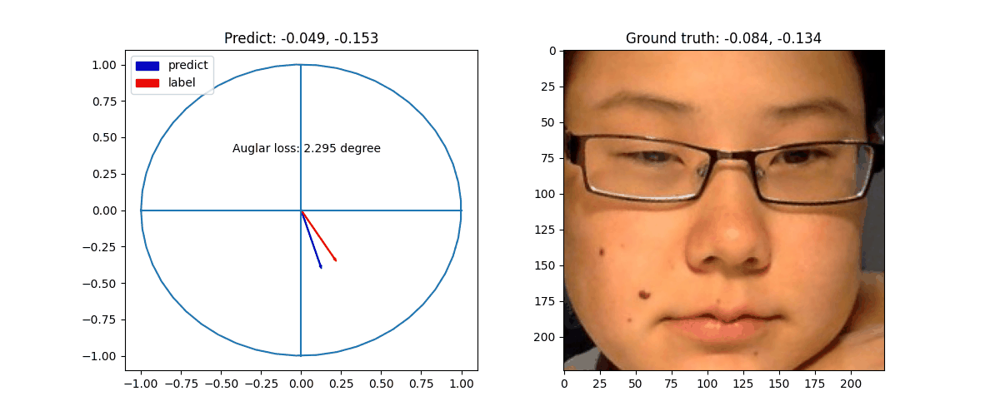
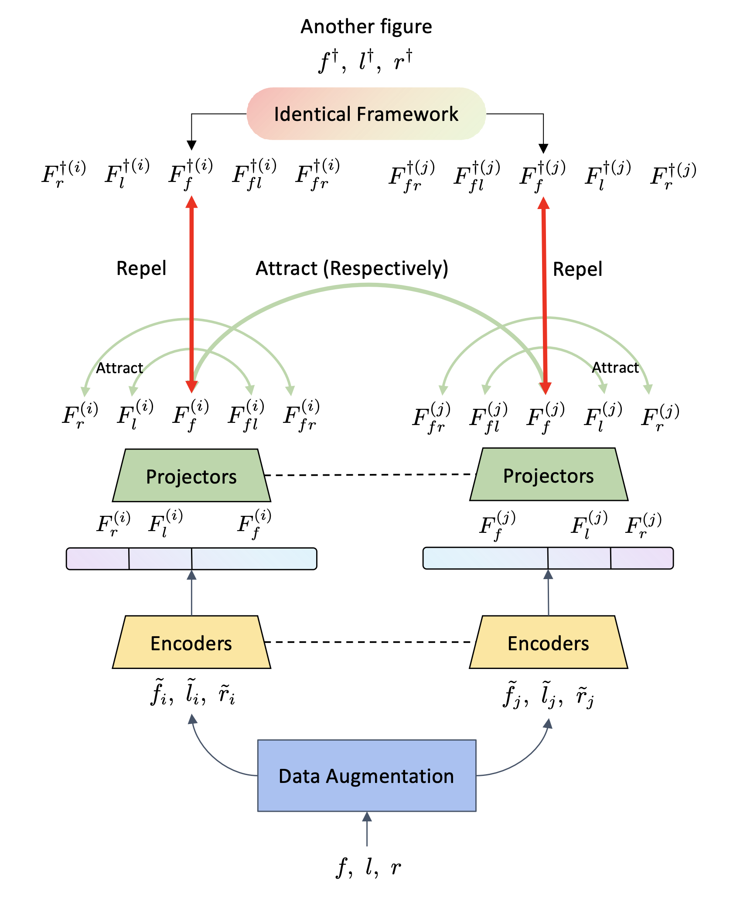
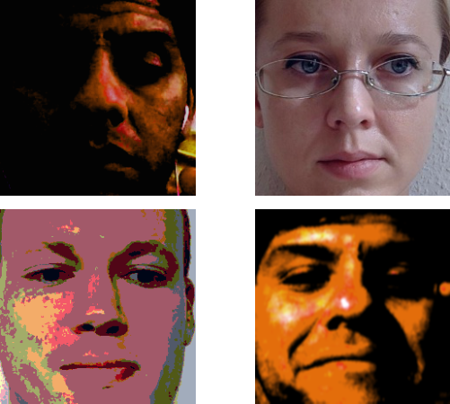
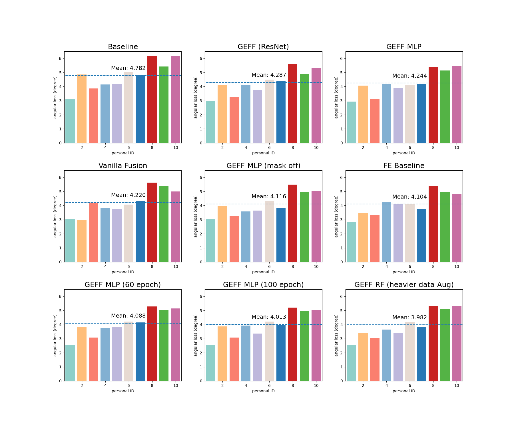

# GEFF: Gaze Estimation with Fused Features

Project of AI2611 Machine Learning, Shanghai Jiao Tong University.

## Introduction

The report of this project is available at: [(update soon)](somewhere).

The "contributions" of this project are as follows:

- Transfer [PIXIE](https://github.com/YadiraF/PIXIE) [CVPR 2021] model from 3D human body reconstruction to gaze estimation. Now the features of head fuse with that of eyes (we call our model as GEFF).
- Implement [SimCLR](https://github.com/google-research/simclr) [ICML 2020] framework for training deep and complicated network (Currently the SimCLR framework was adapted for GEFF).
- Augment datas. Flip the images horizontally. Swap the left eyes and the right eyes. Use masks to generalize our model.

## Installation

### Getting start

Clone our repository:

```shell
$ git clone --recursive https://github.com/anyeZHY/GEFF.git
$ cd GEFF
```

Set up a new environment:

```shell
$ conda env create -f environment.yaml
$ conda activate geff
```

### Download assets and process datas

- For **SJTUers**, download the datasets from [Gaze2022](https://jbox.sjtu.edu.cn/v/link/view/d7dad40649094e1fb6c6a93678ef9512) whose access code is `mrte`.
- Or download the datasets from [MPIIFaceGaze](https://github.com/hysts/pytorch_mpiigaze) and [ColumbiaGazeDataSet](https://www.cs.columbia.edu/CAVE/databases/columbia_gaze/).

Put them into `assets`. Now the folder `assets/` should look like:

```
assets
├── MPIIFaceGaze/
│   └── ...
└── ColumbiaGazeDataSet/
    └── ...
```

Then you need preprocess ColumbiaGazeDataSet by the following command: (~[ time ] hours)

```shell
$ python gaze/utils/[ update soon ].py
```

```shell
assets
├── MPIIFaceGaze/
│   └── ...
├── ColumbiaGazeDataSet/
│   └── ...
├── ColumbiaGazeDataSetCut/
│   └── ...
└── ...
```

## Demo

We save our model at `assets/model_saved/`. You could run the demo to see the results on validation set.

```shell
$ python scripts/gaze_demo.py
```

The GIF will be saved at `figs/gaze_demo.gif`:

<p align="center">
  </br>
</p>

## Model Selection & Training Part

Our GEFF architecture is similar to PIXE architecture:

[ image (update soon) ]

### MPIIGaze

The following scripts may take a while ( ~ 24 hours ).

First you need to get our baseline.

```shell
$ python res_train.py --epoch 40 --lr 0.0001 --print_every 10 \
		--model 'baseline' --data_aug
```

Train the Vanilla Fusion

```shell
$ python res_train.py --lr 0.0001 --epoch 40 --print_every 10 --name 'MF'
		--model 'fuse' --wight 0.2\ 
		--data_aug --flip 0.5
```

Train the GEFF architecture

```shell
$ python res_train.py --lr 0.0001 --epoch 60 --print_every 10 --name 'MF'
		--model 'geff' --t 1\ 
		--data_aug --flip 0.5
```

Other optional command: `--useres`, to use ResNet18 as the eyes' encoder; `--mask`, to implement masks on eyes.

### ColumbiaGaze (update soon)

Similarly, just add `--Columbia` behind the commands above.

### SimCLR (Trial)

Warning: this part is still **INCOMPLETE**.

We design the framework of SimCLR in gaze estimation task:

<p align="center">
  </br>
	SimCLR framework
</p>


We implement a **HEAVY** augmentation for datas, especially for the images of faces. Here's some examples:

<p align="center">
  </br>
	Data Augmentation
</p>
Run the following command to get our pre-trained model:

```shell
$ python simclr_train.py --batch 256 --tau 0.5 --epoch 500 --multi_gpu
or
$ python simclr_train.py --batch 128 --tau 0.5 --epoch 500
```

**Nota Bene:** since large batch size and long training time matters, we use **2** GPUs when training. It may take ~**100** hours.

Then run the following script for a quick test

```shell
$ python res_train.py --lr 0.0005 --epoch 100 --print_every 10
		--model 'simclr' --t 1\ 
		--data_aug --flip 0.5
```

## Results

### Ablation Study

Running logs are available at `logs/MPII`.

<p align="center">
  </br>
	Ablation Studys on MPIIGaze Dataset
</p>

### For TAs (update soon)

We provide a python file to test on the datas which are not access to students.

```shell
$ python scipts/[updata soon].py --MPII --folders 10-16
```

## Development Team

- Haoyu Zhen: [@**anyeZHY**](https://github.com/anyeZHY)
- YiLin Sun: [@**SylvanSun**](https://github.com/SylvanSun)
