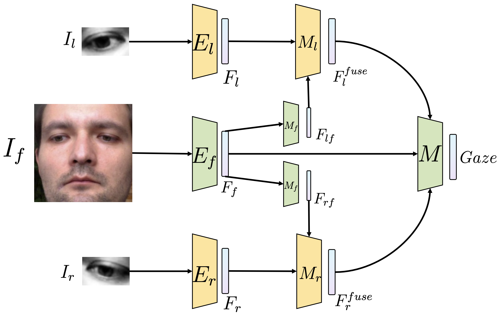

# GEFF: Gaze Estimation with Fused Features

Project of AI2611 Machine Learning, Shanghai Jiao Tong University.

## Introduction

The report of this project is available at: [(update soon)](somewhere).

The "contributions" of this project are as follows:

- Transfer [PIXIE](https://github.com/YadiraF/PIXIE) [CVPR 2021] model from 3D human body reconstruction to gaze estimation. Now the features of head fuse with that of eyes (we call our model as GEFF).
- Implement [SimCLR](https://github.com/google-research/simclr) [ICML 2020] framework for training deep and complicated network (Currently the SimCLR framework was adapted for GEFF).
- Augment datas. Flip the images horizontally. Swap the left eyes and the right eyes. Use masks to generalize our model.

<details>
  <summary>中文版介绍 (Chinese Version, For TAs)</summary><br>
  <li>在该项目中，我们<b>复现</b>了 CVPR 2021 PIXIE 模型并在其基础上迁移至视线估计任务，我们称其为 GEFF.</li>
  <li>为了训练更复杂、更深的网络，我们在 GEFF 的基础上应用了谷歌 ICML 2020 SimCLR 框架，我们<b>复现</b>了论文中的 <b>Contrastive Loss</b>. 此外，我们尝试使用该框架进行数据集间的域迁移任务。</li>
  <li>在参考 pytorch_mpiigaze-master 及 CS231n, Stanford 作业后，我们<b>设计</b>了整个项目的框架，simclr、gaze、scripts 文件夹内文件（不包括 resnet.py）与训练代码<b>均由我们自己实现</b>（核心部分）。</li>
</details>

## Installation

### Getting start

Clone our repository:

```shell
$ git clone --recursive https://github.com/anyeZHY/GEFF.git
$ cd GEFF
```

Set up a new environment:

```shell
$ conda env create -f environment.yaml
$ conda activate geff
```

### Download assets and process datas

- For **SJTUers**, download the datasets from [Gaze2022](https://jbox.sjtu.edu.cn/v/link/view/d7dad40649094e1fb6c6a93678ef9512) whose access code is `mrte`.
- Or download the datasets from [MPIIFaceGaze](https://github.com/hysts/pytorch_mpiigaze) and [ColumbiaGazeDataSet](https://www.cs.columbia.edu/CAVE/databases/columbia_gaze/).

Put them into `assets`. Now the folder `assets/` should look like:

```
assets
├── MPIIFaceGaze/
│   └── ...
└── ColumbiaGazeDataSet/
    └── ...
```

[//]: # (Then you need preprocess ColumbiaGazeDataSet by the following command: &#40;~[ time ] hours&#41;)

[//]: #
[//]: # (```shell)
[//]: # ($ python gaze/utils/[ update soon ].py)
[//]: # (```)

For the ColumbiaGaze dataset, we did some preprocess.
You can download our preprocessed dataset from [ColumbiaGazeCutSet](https://jbox.sjtu.edu.cn/l/n102hw).
Put it into `assets`. Now the folder `assets/` should look like:

```shell
assets
├── MPIIFaceGaze/
│   └── ...
├── ColumbiaGazeDataSet/
│   └── ...
├── ColumbiaGazeCutSet/
│   └── ...
└── ...
```

## Demo

We save our model at `assets/model_saved/`. You could run the demo to see the results on validation set.

```shell
$ python scripts/gaze_demo.py
```

The GIF will be saved at `figs/gaze_demo.gif`:

<p align="center">
  </br>
</p>

## Model Selection & Training Part

Our GEFF architecture is similar to PIXIE architecture:

<p align="center">
  </br>
	Our GEFF Architecture
</p>


### MPIIGaze

The following scripts may take a while ( ~ 24 hours ).

First you need to get our baseline.

```shell
$ python res_train.py --epoch 40 --lr 0.0001 --print_every 10 \
		--model baseline --data_aug
```

```shell
$ python res_train.py --epoch 40 --lr 0.0001 --print_every 10 \
		--model febase --data_aug \
		--flip 0.5
```

Train the Vanilla Fusion

```shell
$ python res_train.py --lr 0.0001 --epoch 40 --print_every 10 --name MF \
		--model fuse --wight 0.2 \ 
		--data_aug --flip 0.5
```

Train the GEFF architecture

```shell
$ python res_train.py --lr 0.0001 --epoch 60 --print_every 10 --name MF \
		--model geff --t 1 \ 
		--data_aug --flip 0.5
```

Other optional command: `--eye_en resnet`, to use ResNet18 as the eyes' encoder; `--mask`, to implement masks on eyes.

### ColumbiaGaze

Similarly, just add `--columbia` behind the commands above.

### SimCLR (Trial)

We design the framework of SimCLR in gaze estimation task:

<p align="center">
  </br>
	SimCLR Framework For GEFF Model
</p>

Run the following command to get our pre-trained model:

```shell
$ python simclr_train.py --name "DA" --tau 0.5 \
                         --epoch 500 --batch 128 --lr 0.0001 \
                         --dataset "mpii"
or
$ python simclr_train.py --name "DA" --tau 0.5 \
                         --epoch 500 --batch 1024 --lr 0.0001 \
                         --multi_gpu --dataset "both"
```

Since **large batch size** and long training time matters, we use **2 GPUs (Nvidia A6000)** when training. It may take ~**70** hours.

Then run the following script for a quick test.

```shell
$ python res_train.py --lr 0.0005 --epoch 100 --print_every 10
		--model "simclr" --t 1\ 
		--data_aug --flip 0.5
```

## Results

### Ablation Study

**Nota Bene**: we use cross validation method to select our models. For **each fold**, we choose the **BEST** angular loss as its final result. I.e., 

$$L(k_{fold})=\min_{i\in[epoch]}AugLoss_i(k_{fold}).$$

Running logs are available at `logs/*`.

<p align="center">
  </br>
	Ablation Studys on MPIIGaze Dataset
</p>
<p align="center">
  </br>
	Ablation Studys on MPIIGaze Dataset (SimCLR VS MLP VS ResNet)
</p>
<p align="center">
  </br>
	Ablation Studys on ColumbiaGaze Dataset
</p>

### For TAs

We provide a python file to test on the datas which are not access to students.

```shell
$ python scipts/test.py
```

## Acknowledgement

We drew our inspirations from the papers [PIXIE](https://github.com/YadiraF/PIXIE) & [SimCLR](https://github.com/google-research/simclr) and the course [CS231n, Stanford University](http://cs231n.stanford.edu).

The computations in this project were run on the cluster supported by the high-performance computing platform of SJTU Student Innovation Center.

## Development Team

- Haoyu Zhen: [@**anyeZHY**](https://github.com/anyeZHY)
- YiLin Sun: [@**SylvanSun**](https://github.com/SylvanSun)
